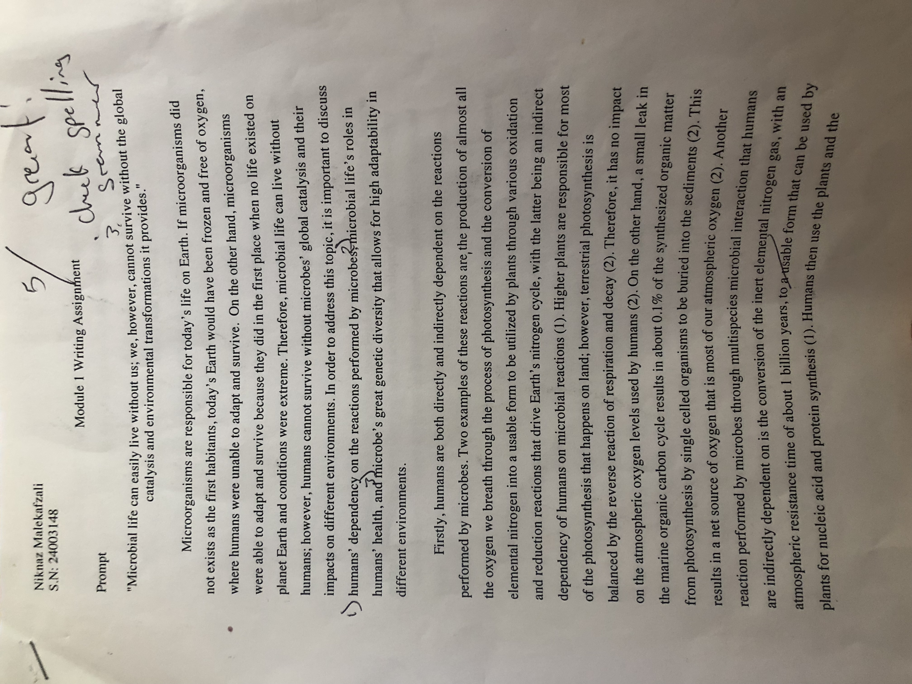
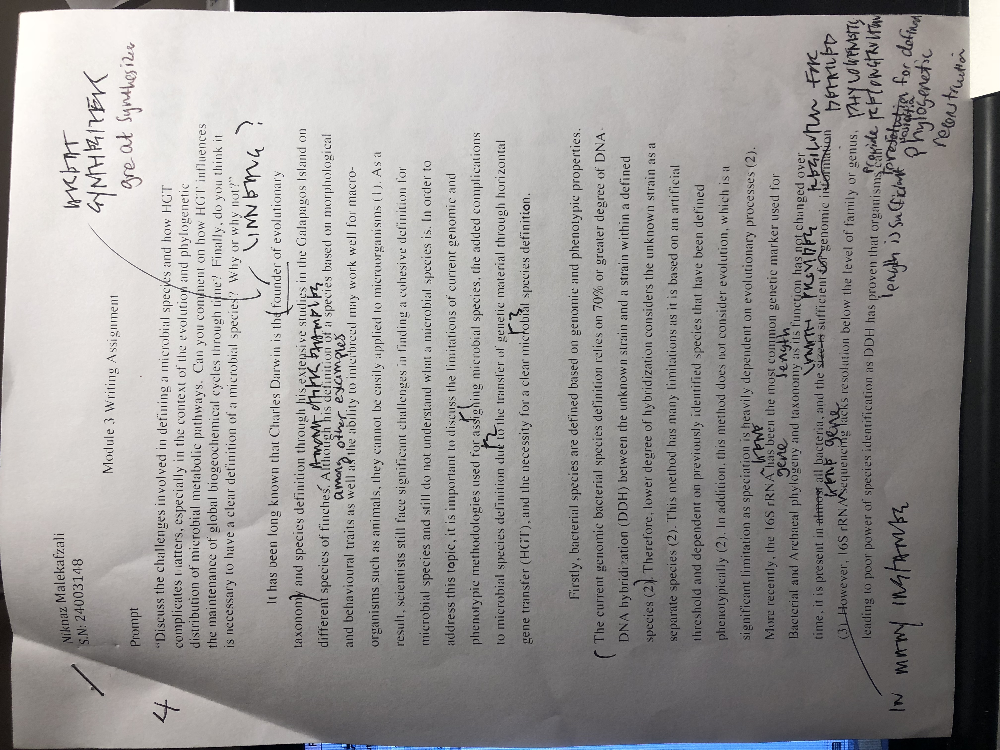
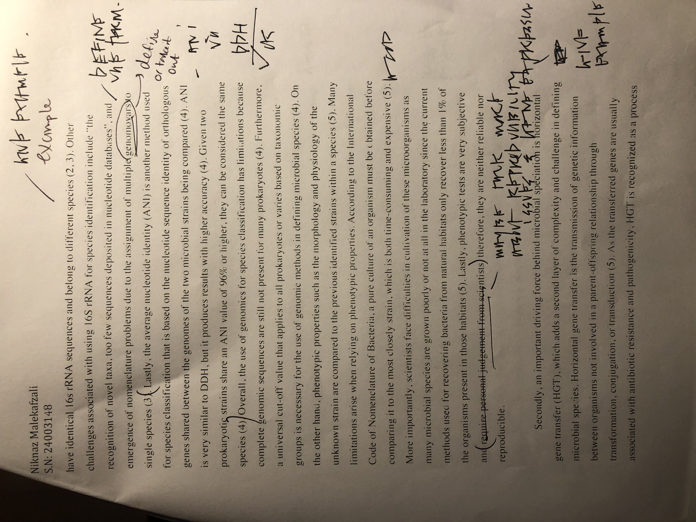
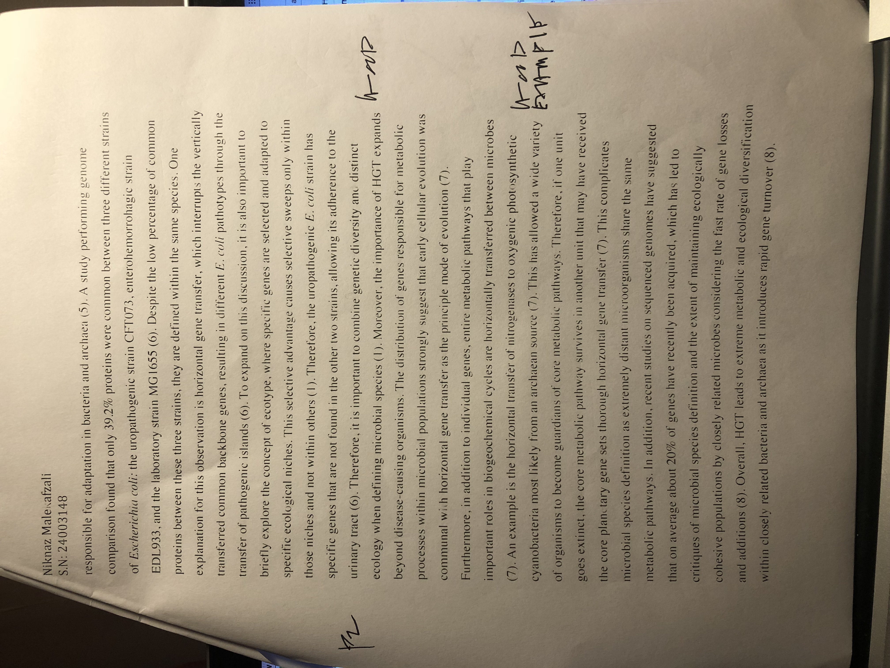
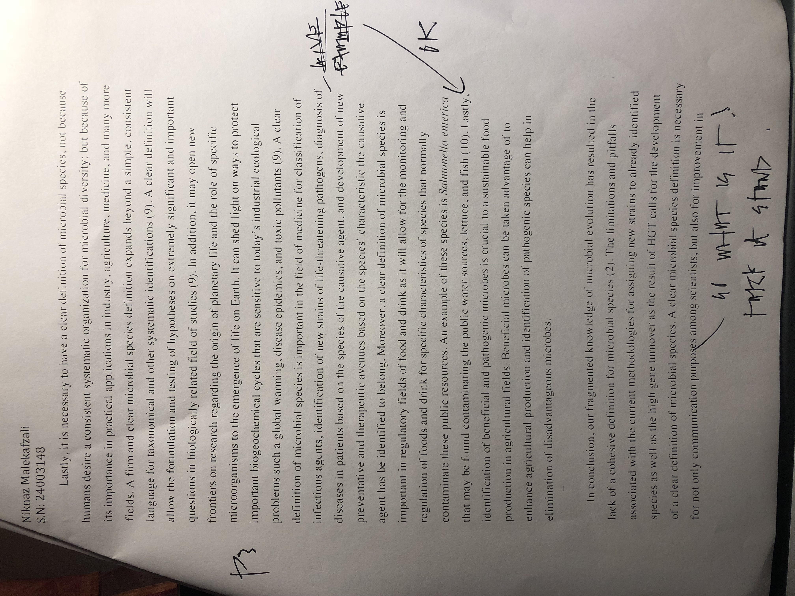
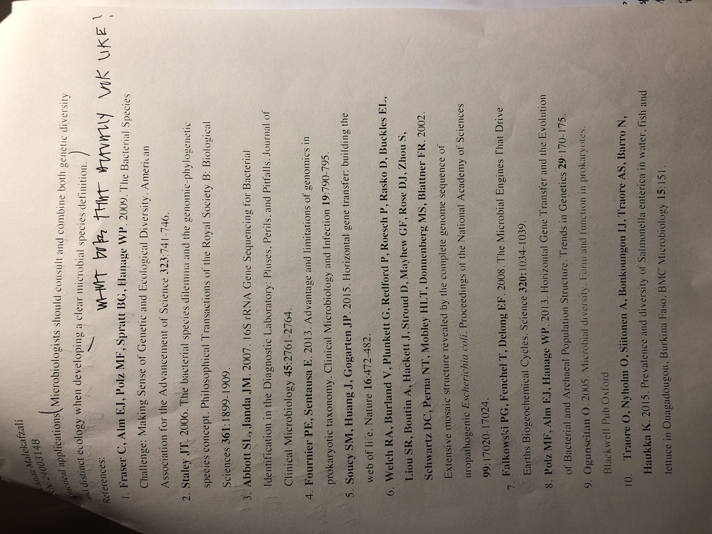

# Module 01 Portfolio Content

### Evidence Worksheet_01 "Prokaryotes: The Unseen Majority"

[Whitman *et al* 1998](https://www.ncbi.nlm.nih.gov/pmc/articles/PMC33863/)

#### Learning Objectives
Describe the numerical abundance of microbial life in relation to ecology and biogeochemistry of Earth systems.


#### General Questions
#### What were the main questions being asked?

The authors were mostly interested to know about growth and turnover rates of prokaryotic cells in different habitats, as well as carbon resources and their respective amounts in different habitats. In addition, the authors were also interested in N and P resources in the environment. 
The main questions being asked were: What is the total number of prokaryotes on Earth? Where are the main prokaryotic habitats and what is the estimated abundance of prokaryotes  in different reservoirs (open ocean, soil, and in oceanic and terrestrial subsurfaces)? How much carbon is being produced by these prokaryotes? What is the total nutrient content present in prokaryotes (N and P)? How do prokaryotes affect the carbon cycle?


#### What were the primary methodological approaches used?

Soil: They used direct counts from coniferous forest soil (ultisol) and previous studies to calculate the cellular density in the soil. In order to calculate the total number of prokaryotic cells in the soil, they combined the value for the amount of soil on earth, which was taken from the literature, with the values found for cellular density.

Aquatics Environments (Oceanic reservoirs, polar region, and freshwater/saline lakes): In order to determine the number of prokaryotic cells, they multiplied the average, estimated cellular density in aquatic environments with the estimated amount of marine and fresh water quantities (Volume) on Earth from the literature. For polar regions, they relied on the mean number of prokaryotes that was published by Delille & Rosiers (literature) and the mean area extent of seasonal ice. 

Terrestrial subsurface:The estimated value for the quantity (volume) of ground water on Earth from the literature was multiplied by the estimated prokaryotic numbers that they had found from ground water based on the values of several sites. In addition, they also calculated the number of prokaryotes in terrestrial subsurface by using the average porosity of the terrestrial subsurface soil, the total pore space occupied by prokaryotes in these pores, and the volume of the upper 4km of the terrestrial subsurface (with the first two being assumptions). 

Carbon Content and production: Estimated the amount of carbon in prokaryotes based on the number of prokaryotic cells in soil, aquatic system, and the subsurface. In soil and subsurface, it has been assumed that one-half of the dry weight is the cellular carbon. In addition, they assumed that the amount of carbon produced by prokaryotes during each turnover is about four times their carbon content, therefore, using this information and the turn over rates, they calculated the production of prokaryotic carbon. For aquatic systems, they assumed that the average cellular carbon to be 5 fg of C/cell and multiplied this by the number of prokaryotic cells in the aquatic system to obtain the total amount of prokaryotic cellular carbon. 


#### Summarize the main results or findings. 

The total number of prokaryotes and the amount of cellular carbon on associated with prokaryotes were estimated to be 4-6x10^30 cells and 350-550 Pg of C, respectively. 

The total amount of prokaryotic carbon is 60-100% of the estimated total carbon in plants. 

Prokaryotes contain large amounts of N (85-130 Pg) and P (9-14 Pg): ~10-fold more than these found in plants. Therefore, prokaryotes represent the largest pool of nutrients in living organisms. 

Prokaryotes are mostly populated in open ocean, soil, and in oceanic and terrestrial subsurfaces with the number of cells being 1.2x10^29, 2.6x10^29, 3.5x10^30, and 0.25-2.5x10^30, respectively. 

Average prokaryotic turnover time:
Subsurface: about 1-2x10^3 year-lower than expected
200m upper ocean: 6-25 days
Ocean below 200m: 0.8 years
soil: 2.5 years

They estimated the cellular production rate of prokaryotes on Earth to be 1.7x10^30 cells/yr and they found that cellular production is the highest in open ocean. Lastly, the high mutation rates, large population size and rapid growth of prokaryotes results in genetic diversity. 


#### Do new questions arise from the results?

Why is the residence time higher than expected for subsurface?

How do we define species and their phylogenetic relationships?

Were the calculations done properly and are the results valid since a lot of assumptions were made in the process of calculation? 

Given the high abundance of prokaryotes in certain environments, what is their role in the total metabolic potential of the ecosystem? 

Why was the cellular rate of production highest in open ocean?

Why was the estimated average prokaryotic turnover time lower than expected? 


#### Were there any specific challenges or advantages in understanding the paper (e.g. did the authors provide sufficient background information to understand experimental logic, were methods explained adequately, were any specific assumptions made, were conclusions justified based on the evidence, were the figures or tables useful and easy to understand)? 

Terminology and units should have explained more. ex: simultaneous mutations

No supplemental figures and texts were provided to further explain their results and methods. Given they had provided further explanation, understanding and interpretations of their calculations and results would have been easier. 

The results were explained in details, however, the credibility of their results is questionable since a lot of the numbers that were used in calculation of their results were either from previous studies (e.x, cell density) for which their method of collection of these data was not explained. In addition, they made a lot of assumptions (e.x, the percentage of the total pore space occupied by prokaryotes) and extrapolations. Therefore, the obtained results and their calculations is questionable and should be improved. 


### Evidence Worksheet_02 “Life and the Evolution of Earth’s Atmosphere”

[Kasting & Siefert 2003](http://science.sciencemag.org/content/296/5570/1066/tab-article-info)

####Learning objectives
Comment on the emergence of microbial life and the evolution of Earth systems

####Comment on the emergence of microbial life and the evolution of Earth systems

Earth is over 4500 years, however, life on Earth is believed to have emerged about 3900 million years ago and it has gone through and has survived extinction periods such as massive meteorite bombardments, hot ocean “bottlenecks”, and world-wide glaciation. During these periods such as hot ocean bottlenecks, only hyperthermophiles (or lithotrophs present in the deep Earth crust) were able to survive, which make it possible that early life diversified near hypothermal vents (or came from outer space possibly Mars), where photosynthetic organisms as well as housekeeping proteins and biochemical processes were developed. The development of an-oxygenic photosynthesis and then oxygenic photosynthesis allowed for the escape of life from hydrothermal settings, and its expansion to new environments. Most of the biochemical pathways that sustain the biosphere now had evolved by about 3500 million years ago.     
    
####Indicate the key events in the evolution of Earth systems at each approximate moment in the time series. If times need to be adjusted or added to the timeline to fully account for the development of Earth systems, please do so. 

**Hadean**

4.6 GA: Solar system formed (30% less luminous than today, inner planets received water vapour (Increase in Pvapour= 500 C) and carbon (Increase in carbon dioxide (CO2)=limestone) 

4.5 GA: Moon was formed, which upon formartion spun and tilted the Earth, formation of day/night cycles and seasons

4.5 GA – 4.1 GA: High levels of CO2 increased temperature 

4.4 GA: Zircon formation: oldest mineral

4.4 GA – 4.1 GA: meteorite impacts

4.1 GA: Evidence of life in zircon from carbon isotopes

4 GA: Oldest rock: Acastagneiss and evidence of plate subduction

**Archaean**

3.8 GA: meteorite bombardment halted-> sea water chemistry stabilized, sedimentary rocks-> possible existence of life? (carbon isotopes again), sulphur reduction (processing), Rubisco!!!! (for carbon fixation)

3.7 Ga: methanogenesis (early)-> Green house CH4: CO2

3.5 GA: Evidence of life-> Photosynthesis (microfossils)+ stromatolites (bacterial aggregation) 

3.5 GA – 2.7GA: Cyanobacteria photosynthesize

2.7 GA: Great oxidation event: responsible for glaciation(hout the presence of methanogenesis, the Earth would have been frozen during the Archean era and more interestingly, if the Earth has been oxygenated before this time, Earth would have been frozen cause methanogens do not like O2 )+emergence of eukaryotes
at the end of Archean-> -life on land 

**Proterozoic**

2.5 GA – 1.5 GA (Proterozoic I): red rock beds observed: evidence of oxidation, oxygen levels increase sharply: microaerobic early atmosphere-> oxic air (complex Eukaryotes involved?), cellular cybernetic switch between mitochondria and chloroplasts-> may control link between photosynthesis CO2 and nitrogen fixation 

1.8-1.96 Ga: Cyanobacteria-> emergence of eukaryotes +algea

1.1 GA: Snowball Earth occurs (glaciation) 

**Phanerozoic**

540 MA-250 MA: Paleozoic: -Expansion of multi-cellular evolution-> Cambrian explosion: increased diversity of life and larger organisms and land plants were observed 

-increase oxygenation of the atmosphere 
-Carboniferous period: fish, cephalopods, and corals 
-Clevonian explosion
-emergence of woody land plants about 400 m years ago  
-Formation of Pangea-> dry, harsh, climate in Pangea’s interior
-Permian extinction: ~95% of species gone extinct
-rapid speciations between Paleozoic and Mesozoic

250 MA-65 MA Mesozoic:
-rise of dinosaurs (gigantism) 
-Atlantic ocean 
-Cretaceous-Tertiary extinction event 
-Immediately post extinction-> nothing over 10kg on land 

65 MA-0 MACenozoic: 
-Dramatic global warming 
-Mammals diversification 
-grass start
-Ice age 

Today 
-Quaternary period
- 200,000 homo sapiens first appear 


####Describe the dominant physical and chemical characteristics of Earth systems at the following waypoints:  

Hadean
There was a massive amount of greenhouse CO2 to keep the Earth warm, as the sun was 30% less luminous than today. The Earth was spun and titled as a result of the formation of moon and gave us the present day-night cycles and the seasons. The Earth suffered massive meteorite impacts. 
Earth was mostly molten rock and very hot

Archaean
Atmosphere was filled with CH4 produced through methanogenesis by methanogens to still keep the Earth warm. As photosynthesis evolved and cyanobacteria photosynthesized, some O2 become present on Earth.

Proterozoic
O2 reacted with atmospheric methane to produce CO2, which led to a net decrease in greenhouse gas effects, making the Earth cold and resulting in glaciation (Snow ball Earth). Oxygen on Earth started oxidizing iron into banded iron formations, seen in sedimentary rock.

Phanerozoic
  Increased diversity of life and larger organisms and land plants were observed. Coal deposits developed as organisms died in permian extinctions and were stored in sediments.There was also the occasional glaciation periods.
  
### Evidence worksheet_03 “The Anthropocene”

[Rockstrom *et al* 2009](https://www.nature.com/articles/461472a)

#### Learning objectives

Evaluate human impacts on the ecology and biogeochemistry of Earth systems.

####General Questions

####What were the main questions being asked?

What are the boundaries that define safe operating space for humanity? What are the Earth-system processes and their corresponding thresholds that could generate unacceptable environmental change if crossed? What parameters play role in the boundaries set for each process? How are the boundaries for different processes coupled and connected? 

#### What were the primary methodological approaches used?

Planetary boundaries: Planetary boundaries are values for control variables. They are either at a safe distance from the thresholds or at dangerous levels. The authors tool a conservative risk-averse approach to quantify the planetary boundaries by taking into account the large uncertainties that surround the many thresholds’ true positions. 

For setting boundaries, the proposed values and ideas were based on connecting the present literatures on the topic such as carbon dioxide levels in the atmosphere, fossil records about extinction rates. 

#### Summarize the main results or findings. 

Nine processes and their corresponding thresholds were defined, for which if the threshold is crossed, unacceptable environmental changes are generated. These 9 processes that need defined planetary boundaries are: climate change, rate of biodiversity loss, interference with the nitrogen and phosphorus cycles, stratospheric ozone depletion, ocean acidification, global fresh water use, change in land use, chemical pollution, and atmospheric aerosol loading.

Boundaries for global freshwater us, change in land use, ocean acidification, and interference with the global phosphorous cycle may be soon approached by humanity. In addition, 3 of the Earth-system processes: climate change, rate of biodiversity loss, and interference with nitrogen cycle have already passed and broken their boundaries. 

Human changes to atmospheric CO2 concentrations should not exceed 350 parts per million by volume and the radiative forcing should not exceed 1 watt per square meter above pre-industrial levels.

Setting a planetary boundary for biodiversity loss is difficult because science cannot yet provide information required for setting these boundaries such as how much and what kids of biodiversity can be lost before the resilience of ecosystem is eroded, therefore, more research is required.

The boundary for nitrogen cycle considers human fixation of nitrogen as a big “valve” that controls massive flow of new reactive nitrogen into Earth. The valve contains the flow of new reactive nitrogen to 25% of its current values or about 35 million tonnes of nitrogen per year.

The proposed model by the authors suggests that anoxic ocean events become more likely within 1000 years given that there is a greater than tenfold increase in phosphorus flowing in the oceans.  

As long as the thresholds are not crossed, long-term social and economical development can be implemented and pursed by humans. 

#### Do new questions arise from the results?

How reliable are the proposed models for setting boundaries? How long does it take for each of these threshold values to be crossed for each process given the same human actions continues? 


#### Were there any specific challenges or advantages in understanding the paper (e.g. did the authors provide sufficient background information to understand experimental logic, were methods explained adequately, were any specific assumptions made, were conclusions justified based on the evidence, were the figures or tables useful and easy to understand)? 


Sufficient background information was provided, which was sufficient enough to give an overview on the topic to readers whom may not be familiar with this topic. 

No figures or supplementary figures were provided for the statistics about the processes and their proposed models.

A lot of the connections were made based on previous literature, which questions the reliability of their claims and proposed model due to the lack of other evidence to support them. 

  
### Problem set_01 “Prokaryotes: The unseen majority”

[Whitman *et al* 1998](https://www.ncbi.nlm.nih.gov/pmc/articles/PMC33863/)

#### Learning objectives
Describe the numerical abundance of microbial life in relation to the ecology and biogeochemistry of Earth systems.

#### Specific Questions

####What are the primary prokaryotic habitats on Earth and how do they vary with respect to their capacity to support life? Provide a breakdown of total cell abundance for each primary habitat from the tables provided in the text.

The primary prokaryotic habitats on Earth are aquatic (seawater)
soil, and marine sediment/soil subsurface. The total number of prokaryotes in soil is 255.6x10^27 cells, 1.181x10^29 cells in aquatic habitats (mostly found in the upper 200m of the open ocean), and 3.8x10^30 cells in subsurface sediments. 

####What is the estimated prokaryotic cell abundance in the upper 200 m of the ocean and what fraction of this biomass is represented by marine cyanobacterium including Prochlorococcus? What is the significance of this ratio with respect to carbon cycling in the ocean and the atmospheric composition of the Earth?

The estimated prokaryotic cell abundance in the upper 200 m of the ocean is 3.6x10^28 cells at cellular density of 5x10^5 cells/mL. In this habitat, the average cellular density of the autotrophic marine cyanobacterium (including Prochlorococcus) is 4x10^4 cells/mL, which would make 8% of the biomass in the upper 200m of the ocean that supports carbon availability for the rest of the 92% heterotrophs present.  

Calculation: (4x10^4 cells/ml)/(5x10^5 cells/ml)x100=8%

####What is the difference between an autotroph, heterotroph, and a lithotroph based on information provided in the text?

According to the article, autotrophs are organisms that use the substances around them to make complex organic compounds (they fix inorganic carbon e.x co2-> biomass). Therefore, these organisms produce their own food. 

Heterotrophs: Assimilate organic matter to produce energy (produce carbon from organic sources)
 
Lithotrophs: assimilate and metabolize inorganic matter and release energy (obtain electrons from inorganic sources) 

####Based on information provided in the text and your knowledge of geography what is the deepest habitat capable of supporting prokaryotic life? What is the primary limiting factor at this depth?

The deepest habitat capable of supporting prokaryotic life is terrestrial subsurface sediments at the depth of 4000m (4km), with the primary limiting factor being the temperature with the average of 125C, which is close to the upper temperature limit for prokaryotic life (every one km is about 22C difference). The deepest point on earth where life can exists is the Mariana Trench, which is about 10.9km deep. You can go an extra 4-5 km where prokaryotic cells reside. The limiting factor for this depth is temperature. 

####Based on information provided in the text and your knowledge of geography what is the highest habitat capable of supporting prokaryotic life? What is the primary limiting factor at this height?

The highest point on Earth where life exists is the Mount Everest, which is about 8.8 km above sea level. However, the highest habitat capable of supporting prokaryotic life is the atmosphere where prokaryotes are present as high as 57-77 km (however a more realistic boundary would be around 20km above mount Everest).The limiting factors include presence of different percentage of gasses as an example lower oxygen percentage in higher altitudes as well as different gas pressures. The lack of moisture and nutrients as well as high ionizing radiation. In addition, temperature could be another limiting factor in this habitat. 
Therefore, the extent at which life exists on Earth is around 24km.

####Based on estimates of prokaryotic habitat limitation, what is the vertical distance of the Earth’s biosphere measured in km?

The extent at which life exists on Earth is around 24km. The biosphere is the part of the Earth where life exists, with a  vertical distance of 24 km. This is from Mount Everest (8.8km above sea level) to the bottom of Mariana’s Trench (10.9 km deep), with an addition 4km added. 

####How was annual cellular production of prokaryotes described in Table 7 column four determined? (Provide an example of the calculation)

Annual cellular production= (Population size)/(turnover time per year)(multiplied by the number of days in a year)= cells/year

Sample calculation: 
(3.6x10^28 cells*365/ 16 turnovers)= 8.2x10^29 cells/ year

####What is the relationship between carbon content, carbon assimilation efficiency and turnover rates in the upper 200m of the ocean? Why does this vary with depth in the ocean and between terrestrial and marine habitats?

Carbon content in a prokaryotic cells= ~20 fg (assuming 5-20 fg of C/prokaryotic cell)= (20)(10^-30) Pg/cell
-Carbon assimilation efficiency: 0.2 (20%) converting inorganic carbon into biomass

Number of cells= 3.6x 10^28 cells

(3.6x10^28cells)(20x10^-30 Pg/cell)=0.72 Pg C in marine heterotrophs
(0.72 Pg C)(4)= 2.88 Pg/year
51 Pg c/year -> 85% consumed = 43 Pg C consumed per year
(43 Pg C/year)/(2.88 Pg/year)=14.9 
1 turn over every 24.5 days

A large population will have a higher carbon content due as well as a longer turnover as the result. Therefore, carbon content is dependent on turnover rate and population size assuming carbon assimilation efficiency remains constant.

These values vary due to the amount of exposure to sunlight and the lytic bacteriophages that are largely present in the upper 200m of the ocean. 

####How were the frequency numbers for four simultaneous mutations in shared genes determined for marine heterotrophs and marine autotrophs given an average mutation rate of 4 x 10-7 per DNA replication? (Provide an example of the calculation with units. Hint: cell and generation cancel out)

*Have to raise to the power of 4 since it’s four mutation in a single gene at the same time: (4x10^-7)^4=256x10^-28 mutation/generation

Now we need to know how many times do cells generate themselves per year aka turnover time: 365/16=22.8 turnovers/year multiplied by (3.6x10^28 cells)= 8.2x10^29 cells/year

[(256x10^-28 mutation)/(per generation)]x (8.2x10^29 cells/year)= 20992= 2.1x10^4 mutation/year

(20992 mutation/year)x(1year/12months)x(1 month/28 days)x(1day/24hr)=2.603 mutation/hr= 0.38=0.4 hr/ mutation

autotroph: (256x10^-28 mutation)x[(7.1x10^29)/year]x(1/12x28x24)=0.44~0.5 hr/mutation

####Given the large population size and high mutation rate of prokaryotic cells, what are the implications with respect to genetic diversity and adaptive potential? Are point mutations the only way in which microbial genomes diversify and adapt?

One of the factors that result in genetic diversity and formation of novel species is mutations. In addition to mutations, Horizontal Gene Transfer (HGT): transformation, transduction, and conjugation are responsible for the genetic diversity seen in prokaryotes. Prokaryotic cells who have favarouble mutations, will adopt better to their sorounding environment and survive better. 

####What relationships can be inferred between prokaryotic abundance, diversity, and metabolic potential based on the information provided in the text?

Large prokaryotic cells population allows for rare events to occur more frequently in nature. For example, prokaryotes have enormous potential to acquire genetic diversity by accumulating mutations, however, growth rates must also be taken into account when measuring potential mutational changes in a population. Large, slow growing populations may produce fewer cells and fewer mutations compared to small, fast growing populations. Therefore, if we have high abundance, high growth rate and therefore rapid replication, then we have high mutation rates, which increases the diversity of the population. Increase in the diversity of population increases metabolic potential in response to selective pressure and stress. 


### Problem set_02 “Microbial Engines”

[Falkowski *et al* 2008](http://science.sciencemag.org/content/320/5879/1034.long)

####Learning objectives 

Discuss the role of microbial diversity and formation of coupled metabolism in driving global biogeochemical cycles.

####Specific Questions

####What are the primary geophysical and biogeochemical processes that create and sustain conditions for life on Earth? How do abiotic versus biotic processes vary with respect to matter and energy transformation and how are they interconnected?

The primary geophysical processes that create and sustain conditions for life on Earth are tectonics and atmospheric photochemical processes that continuously supply substrates and remove products, which results in creation of geochemical cycles. Both of these geophysical processes allow elements and molecules to interact with each other, and chemicals bonds to form and break. Furthermore, the biogeochemical processes that create and sustain conditions for life on Earth are acid-base and redox reactions. The biotic redox reactions depend on less external energy compared to the acid-base abiotic reactions. In addition, abiotic process such as volcanism and rock weathering are very important processes for re-supply of C, S, and P. The abiotic acid-base chemistry is the transfer of protons without electrons. However, the biotic redox reactions involve successive transfers of electrons and protons and are responsible for more of the major elements C, H, N, O, and S. Feedbacks between the microbial metabolisms and geochemical processes create the average redox condition of the oceans and atmosphere. The oxidation of Earth is driven by photosynthesis, which is not directly dependent on preformed bond energy. The way that abiotic and biotic processes are interconnected is by the nested abiotically driven acid-base reactions that are created by biogeochemical cycles on a planetary scale as well as biologically driven redox reactions that set lower limits on external energy. 

####Why is Earth’s redox state considered an emergent property?

Feedbacks between the microbial metabolisms and geochemical processes create the average redox condition of the oceans and atmosphere. Therefore, the Earth’s redox state is considered an emergent property of microbial life on a planetary scale. The oxidation of Earth is driven by photosynthesis, which is not directly dependent on preformed bond energy.   

####How do reversible electron transfer reactions give rise to element and nutrient cycles at different ecological scales? What strategies do microbes use to overcome thermodynamic barriers to reversible electron flow? 

An example of a reversible reaction is the conversion of inert N2 to NH4+ through nitrogen fixation, which is a biologically irreversible reaction and this is the only process that makes N2 accessible for the synthesis of proteins and nucleic acid. This reaction is catalyzed by an enzyme called nitrogenase which is inhibited by oxygen.In addition, microorganisms carry genes that encode for the machinery involved in redox half-cells which is for energy transducting pathways. In order to overcome thermodynamic’s barriers, microbes use identical or near-identical pathways for forward and reverse reactions. Given the concentrations of the substrates become very low, reverse reactions can become possible. Since reactions tend to favour equilibrium, if the concentrations of the substrates are low, the equilibrium will favour shifting towards the substrates. In addition to equilibrium of reactions, metabolic relationships and interactions between microorganisms would make the reversible reactions possible. This would be as one organism provides energy or a metabolite where it could be used by another organism to either perform the opposite reaction or create an environment where the reverse reaction is favourable. 

####Using information provided in the text, describe how the nitrogen cycle partitions between different redox “niches” and microbial groups. Is there a relationship between the nitrogen cycle and climate change? 

In order for N2 to be accessible for the synthesis of proteins and nucleic acids in organisms, it has to converted to NH4+ through nitrogen fixation which is catalyzed by an enzyme called nitrogenase that is inhibited in the presence of oxygen. However, in the presence of oxygen, NH4+ is oxidized to nitrate in a two-stage pathway. In the first step, a group of bacteria or archea is required to oxidize ammonia to NO2- and in the second step, NO2- is oxidized to NO3- by a different nitrifying bacteria. The nitrifiers perform this reaction to produce CO2 into organic matter by using the small differences in redox potential in the redox reactions. In the absence of oxygen, another set of opportunistic microbes use NO2- and NO3- as electron acceptor in anaerobic oxidation of organic matter, which will ultimately lead to the formation of N2, which closes the N-cycle. The independent electron pool of the N-cycle is influenced by the availability of organic matter and the production of oxygen through photosynthesis. It is important to notes that that climates change affects sunlight availability which in turn affects photosynthesis since sunlight is the main source of energy in photosynthesis. Photosynthesizers that use nitrogen oxides as electron acceptors will be affected due to changes in the sunlights. On the other hand, the N-cycle could also influence the climate change, which is because nitrifying organisms may use NH4+ or NO2- for reduction of CO2, which reduces green house gasses. 

####What is the relationship between microbial diversity and metabolic diversity and how does this relate to the discovery of new protein families from microbial community genomes?  

Through time, metabolic pathways have evolved to make use of the available substrates that are the end products of other microbial metabolism. The series of half redox reactions of a given elemental cycle such as nitrogen are distributed between different organisms, which allows this interaction between a microbial community with each organism having a specialized role in the community. When more metabolic diversity is present, organisms take on special roles in different pathways that require the help of other organisms, which leads to microbial diversity. In addition, horizontal gene transfer not only make it possible for microbes of different species to transfer genes, but it will also allow for an entire metabolic pathways to be transferred between different species to other species. 

The number of protein families within individual Bacterial and Archaeal genomes have a linear relationship with the number of newly discovered genes per genome. Genome size appears to correlate with evolutionary rate, but not metabolic processes.
Diverse organisms live in diverse environments, which all lead to different, adapted genes that produce proteins required to survive in those specific conditions. Thus with more microbial diversity, more diverse metabolic pathways are required for organisms to live in their existing environment which results in a condition where new proteins are expressed to repair or replace the existing performing proteins.

####On what basis do the authors consider microbes the guardians of metabolism?  

Environmental selection on microbial phenotype leads to the evolution of the boutique genes that ultimately protect the metabolic pathway. Microbes are vessels that carry metabolic machines through long periods of times, different geological places, and extreme environmental disturbances. Transfer of the core planetary gene sets either through vertical or horizontal gene transfer has allowed a wide range of organisms to become the guardians of metabolism, even if individual taxonomic unit does not survive and go extinct, the core metabolic pathway has a strong chance of survival in other units. 


### Writing assessment_01




####Prompt

"Microbial life can easily live without us; we, however, cannot survive without the global catalysis and environmental transformations it provides."
 
Microorganisms are responsible for today’s life on Earth. If microorganisms did not exists as the first habitants, today’s Earth would have been frozen and free of oxygen, where humans were unable to adapt and survive.On the other hand, microorganisms were able to adapt and survive because they did in the first place when no life existed on planet Earth and conditions were extreme. Therefore, microbial life can live without humans; however, humans cannot survive without microbes’ global catalysis and their impacts on different environments. In order to address this topic, it is important to discuss humans’ dependency on the reactions performed by microbes, microbial life’s roles in humans’ health, and microbe’s great genetic diversity that allows for high adaptability in different environments. 


Firstly, humans are both directly and indirectly dependent on the reactions performed by microbes. Two examples of these reactions are the production of almost all the oxygen we breath through the process of photosynthesis and the conversion of elemental nitrogen into a usable form to be utilized by plants through various oxidation and reduction reactions that drive Earth’s nitrogen cycle, with the latter being an indirect dependency of humans on microbial reactions (1). Higher plants are responsible for most of the photosynthesis that happens on land; however, terrestrial photosynthesis is balanced by the reverse reaction of respiration and decay (2). Therefore, it has no impact on the atmospheric oxygen levels used by humans (2). On the other hand, a small leak in the marine organic carbon cycle results in about 0.1% of the synthesized organic matter from photosynthesis by single celled organisms to be buried into the sediments (2). This results in a net source of oxygen that is most of our atmospheric oxygen (2). Another reaction performed by microbes through multispecies microbial interaction that humans are indirectly dependent on is the conversion of the inert elemental nitrogen gas, with an atmospheric resistance time of about 1 billion years, to usable form that can be used by plants for nucleic acid and protein synthesis (1). Humans then use the plants and the animals that use these plants. The reductive, irreversible process of converting elemental nitrogen to NH4+ is catalyzed by nitrogenase- a conserved enzyme complex that is inhibited in the presence of oxygen (1). NH4+ can then be oxidized to nitrate in the presence of oxygen through a two stage process with first step being the oxidation of ammonia to NO2− by a particular group of Bacteria or Achaea and the second step involving oxidization of NO2−to NO3− by a different nitrifying bacteria (1). Finally, opportunistic microbes use NO2− and NO3− as electron acceptors in the absence of oxygen in oxidation of organic matter, which ultimately leads to the formation of N2, and completion of the nitrogen cycle (1). Therefore, it is for these different microbial species and their interactions that drive both the production of oxygen on Earth as well as a series of coupled redox reactions to complete the nitrogen cycle. 


Secondly, trillions of microbes have lived and evolved on and within human beings, protected humans from pathogens and have developed symbiotic relationship with the humans. To further expand on the role of microbes on the humans’ body and health, the human gut microbiota will be discussed. The human gut microbiota is considered a separate organ by itself because of its great metabolic capability and functional plasticity. The gut microbiota is involved in some human biological processes such as regulating and adjusting the metabolic phenotype, protecting against foreign pathogens, and development of innate immunity (3). To address modulation of metabolic phenotype by the gut microbiota, it is important to note that by using specific enzymes and biochemical pathways encoded by genes that are not found in human genome, the gut microbiota has the potential to increase energy and nutrient extraction from food, as well as, altering appetite signals (3). Furthermore, microbes in the gut are involved in metabolism of indigested carbohydrates as well as vitamin biosynthesis such as vitamin K, which is a required co-factor for the production of blood clotting factors (4). The absence of the Vitamin K producing microbes by antibiotic treatment can result in excessive bleeding upon disruption of the outer epithelial layer. In addition, intestinal flora’s ability to metabolize indigestible carbohydrates to short-fatty acids, allow humans to digest plant-based foods, which would be impossible without the absence of these microbes (4). Furthermore, the human gut microbiota acts as a physical barrier by production of antimicrobials and “competitive exclusion” to protect the host from foreign pathogens (3).  Lastly, the gut microbiota is essential in development of intestinal mucosa and immune system of the host usually by promoting maturation of immune cells or development of the immune system. An example of this is the development of innate immunity by the interaction between TLR-4 on immune cells of myeloid lineage and activation of an intracellular signaling network leading to cytokine and chemokine production (5). Therefore, the microbes that reside on and in humans play a major role both metabolically and in shaping the immune system. Therefore, absence of these microbes would cause not only metabolic constraints, but would also put the human body in an immune-compromised state, possibly resulting in the development of various diseases. 


Lastly, it is important to note that microbes are independent from humans and do not rely nor need humans for their survival. Despite all the symbiotic relationships that are present today between microorganisms and humans such as the previously mentioned human intestine, microorganisms are able to evolve and adapt to any condition as they have been on the ever-changing planet Earth (6). The number of prokaryotic cells on Earth is calculated to be 4-6 x10^ 30 cells (7).The large population size of prokaryotes and their rapid growth and turnover rates provides potential for significant genetic diversity that allows these microorganisms to evolve to fit and adopt to all types of environments as has been shown throughout the Earth’s history. Microbes have survived extreme conditions such as hot ocean bottlenecks where only thermophiles could survive (6). Environmental selections lead to the evolution of the boutique genes that protect the metabolic pathway used by microbes, therefore, if one unit goes extinct, the core metabolic pathway survives in another unit that has received the core planetary gene sets either thorough vertical or horizontal gene transfer (1). Therefore, microbes act as vessels that carry metabolic machines through long periods of time, different geological places, and extreme environmental disturbances (1). An example of adaptation and evolution of microbes is seen in the process of nitrogen fixation by cyanobacteria using the nitrogenase enzyme. The nitrogenase enzyme is poisoned by oxygen; however, cyanobacteria have evolved complex mechanisms for protecting this enzyme. A few examples of these mechanisms highlighting the highly evolved machinery used by cyanobacteria are only fixing nitrogen in specialized cells called heterocysts, fixing nitrogen at night and photosynthesizing by day, and fixing nitrogen in the morning and photosynthesizing in the afternoon (2). 


 In conclusion, humans are dependent on the reactions performed by microorganisms as well as their roles in human survival and health. They may be able to survive without humans for a few days; however, in the absence of microbes the Earth becomes an inhabitable place for humans at a very fast-pace. On the other hand, microorganisms are fast evolving living organisms that can survive and adapt to every type of environment without depending on humans. Therefore, microorganisms are necessary for human life on Earth and their presence and performance provide the conditions for a habitable Earth.
 
 
References: 

1. Falkowski PG, Fenchel T, Delong EF. 2008. The Microbial Engines That Drive Earths Biogeochemical Cycles. Science 320:1034-1039. 
[PMID18497287](http://science.sciencemag.org/content/320/5879/1034.long)

2. Kasting JF, Siefert JL. 2002. Life and Evolution of Earth’s Atmosphere. Life and Evolution of Earth’s Atmosphere 296:1066-1068.
[PMID12004117](https://www.ncbi.nlm.nih.gov/pubmed/12004117)

3. Wang B, Yao M, Lv L, Ling Z, Li L. 2017. The Human Microbiota in Health and Diseases. Microbiology 3:71-82. 
(https://www.sciencedirect.com/science/article/pii/S2095809917301492)

4. Gorbach SL. 1996.  Chapter 95: Microbiology of Gastrointestinal Tract. University of Texas Medical Branch at Galveston.
[PMID21413258](https://www.ncbi.nlm.nih.gov/books/NBK7670/)

5. Alexander C, Rietschel ET. 2001. Bacterial lipopolysaccharides and innate immunity. Journal of Endotoxin Research 7:167-202.
[PMID11581570](http://journals.sagepub.com/doi/abs/10.1177/09680519010070030101)

6. Nisbet EG, Sleep NH. 2001. The habitat and nature of early life. Nature 409:1083-1091. 
(https://www.nature.com/articles/35059210)

7. Whitman WB, Coleman DC, Wiebe WJ. 1998. Prokaryotes: The unseen majority. Proceedings of the National Academy of Sciences 95:6578-6583. 
[PMC33863](https://www.ncbi.nlm.nih.gov/pmc/articles/PMC33863/)


###Module 1 References 

1. Falkowski PG, Fenchel T, Delong EF. 2008. The Microbial Engines That Drive Earths Biogeochemical Cycles. Science 320:1034-1039. 
[PMID18497287](http://science.sciencemag.org/content/320/5879/1034.long)

2. Kasting JF, and Siefert JL. 2002. Life and the evolution of Earth's atmosphere. Science. 296(5570):1066-1068. 
[PMID12004117](https://www.ncbi.nlm.nih.gov/pubmed/12004117)

3. Leopold A. 1949. The Land Ethic. In A Sand County Almanac. Oxford University Press. London.

4. Zehnder A.J.B. 1988. Biology of Anaerobic Microorganisms.   

5. Nisbet EG, Sleep NH. 2001. The habitat and nature of early life. Nature 409:1083-1091. 
(https://www.nature.com/articles/35059210)

6. Whitman WB, Coleman DC, Wiebe WJ. 1998. Prokaryotes: The unseen majority. Proceedings of the National Academy of Sciences 95:6578-6583.
[PMC33863](https://www.ncbi.nlm.nih.gov/pmc/articles/PMC33863/)

7. Waters CN. 2016. The Anthropocene is functionally and stratigraphically distinct from the Holocene. Science 351:137–147.
[PMID26744408](https://www.ncbi.nlm.nih.gov/pubmed/26744408)

8. Schrag DP. 2012. Geobiology of the Anthropocene. Fundamentals of Geobiology 425–436.
(https://onlinelibrary.wiley.com/doi/10.1002/9781118280874.ch22)

9. Kallmeyer J, Pockalny R, Adhikari RR, Smith DC, and D'Hondt S. 2012. Global distribution of microbial abundance and biomass in subseafloor sediment. Proc Natl Acad Sci USA. 109(40):16213-16216. [PMID22927371](https://www.ncbi.nlm.nih.gov/pubmed/22927371)

10. Mooney C. 2016. Scientists say humans have now brought on an entirely new geologic epoch. The Washington Post 1–5.
(https://www.washingtonpost.com/news/energy-environment/wp/2016/01/07/scientists-say-humans-have-now-brought-on-an-entirely-new-geologic-epoch/?utm_term=.a25428157ae9)

11. Rockstrom J *et al*. 2009. A safe operating space for humanity. *Nature* 461, 472–475. 
(https://www.nature.com/articles/461472a)

12. Achenbach J. 2012. Spaceship Earth: A new view of environmentalism. The Washington Post. WP Company. 
(www.washingtonpost.com/national/health-science/spaceship-earth-a-new-view-of-environmentalism/2011/12/29/gIQAZhH6WP_story.html)

13. Canfield DE, Glazer AN, Falkowski PG. 2010. The Evolution and Future of Earth’s Nitrogen Cycle. Science 330:192–196. [PMID20929768](https://www.ncbi.nlm.nih.gov/pubmed/20929768)

14. Falkowski P, Scholes RJ, Boyle E, Canadell J, Canfield D, Elser J, Gruber N, Hibbard K, Högberg P, Linder S, Mackenzie FT, Moore B 3rd, Pedersen T, Rosenthal Y, Seitzinger S, Smetacek V, and Steffen W. 2000. The Global Carbon Cycle: A Test of Our Knowledge of Earth as a System. Science 290:291–296. [PMID11030643](https://www.ncbi.nlm.nih.gov/pubmed/11030643)


# Module 02 Portfolio Content

###Evidence worksheet_04 “Bacterial Rhodopsin Gene Expression”

[Martinez *et al* 2007](https://www.ncbi.nlm.nih.gov/pmc/articles/PMC1838496/)

####Learning objectives 

Discuss the relationship between microbial community structure and metabolic diversity

Evaluate common methods for studying the diversity of microbial communities

Recognize basic design elements in metagenomic workflows

####General Questions

####What were the main questions being asked?

What is the physiological basis of light activated growth stimulation in PR-containing marine bacteria? What is the function of each gene in the photosystem biosynthetic pathway?


#### What were the primary methodological approaches used?

•	To characterize PR photosystem genetics and biochemistry, marine picoplankton large-insert genomic library for recombinant clones expressing PR photosystems in vivo were surveyed.

•	In order to verify functional annotation of each gene product in intact PR-based photosystems biosynthetic pathways, insertional mutants were analyzed using cell pigmentation and HPCL: genetic and biochemical analysis of transposon mutants were used to verify the function of gene products in the photopigment and opsin biosynthetic pathways. 

•	Luciferase-based assay was used to measured light-induced changes in ATP levels in the PR-photosystem-containing clones and PR- mutant derivatives.

•	Light activated proton-translocation activity was assays for cells grown under high-copy number conditions. 


#### Summarize the main results or findings. 

•	The screening process exploited transient increase in vector copy number was, which significantly enhanced the sensitivity of the phenotypic detection. In addition, two genetically distinct recombinants that were initially identified by their orange pigmentation were expressing a small cluster of genes encoding a complete PR-based photosystem.

•	A fully functional PR photosystem than enabled photophosphorylation in recombinant E. coli cells was generated upon heterologous expression of six genes. 

•	Phototrophic capabilities in a chemoorganotrophic microorganism can be gained as a result of a single genetic event, which explains the presence of PR photosystems among diverse microbial taxa. 

•	Spectro-toning: the genes for the proton pump has evolved to respond to the amount of light that gets to the level of the ocean they reside in. 

•	Increasing fosmid copy number can significantly enhance detectable levels of recombinant gene expression and therefore increases the detection rate of desired phenotypes in metagenomic libraries.

•	Results from cell pigmentation and HPLC supported the “functional assignments” of genes associated with PR biosynthetic pathways and demonstrates that these genes are both necessary and sufficient to induce retinal biosynthesis in E. coli cells. 

•	Decrease in pH was observed during proton-tanslocating assay in PR+ clones but not in mutants containing transposon inserts in the PR gene. 

•	ATP measurements showed significant light-induced increase in cellular ATP of PR+ clones but not in cells lacking the PR- mutants. 

 
#### Do new questions arise from the results?

Are these results consistent and producible in other bacterial cells beside E. coli?

####Were there any specific challenges or advantages in understanding the paper (e.g. did the authors provide sufficient background information to understand experimental logic, were methods explained adequately, were any specific assumptions made, were conclusions justified based on the evidence, were the figures or tables useful and easy to understand)? 

The authors provided sufficient background information to educate the readers whom may be unfamiliar with the topic. 

The provided figures were easy to understand and also helped in understanding the results and the pathway better. 

All the claims and conclusions were supposed by evidence, increasing the credibility of the authors. 


### Problem set_03 “Metagenomics: Genomic Analysis of Microbial Communities”

#### Learning objectives
Specific emphasis should be placed on the process used to find the answer. Be as comprehensive as possible e.g. provide URLs for web sources, literature citations, etc.  
*(Reminders for how to format links, etc in RMarkdown are in the RMarkdown Cheat Sheets)*

####Specific Questions

#### How many prokaryotic divisions have been described and how many have no cultured representatives (microbial dark matter)?
  
Solden L, Lloyd K, Wrighton K. 2016. The bright side of microbial dark matter: lessons learned from the uncultivated majority. Current Opinion in Microbiology 31:217–226.
[PMID27196505](https://www.ncbi.nlm.nih.gov/pubmed/27196505)

Schloss PD, Girard RA, Martin T, Edwards J, Thrash C. Status of the Archaeal and Bacterial Census: an Update. mBio 7:e00201-16
[PMC4895100](https://www.ncbi.nlm.nih.gov/pmc/articles/PMC4895100/)

Up to 2016, 89 bacterial phyla and 20 archaeal phyla had been recognized using small 16s rRNA databases. However, the true phyla count is much higher, up to 15000 bacterial Phyla, and this is because many microbes live in life “shadow biosphere”. However, in 2006 a study claimed that 24 of the 65 identified bacterial phyla back then had no cultured representative and 14 of the 20 archaeal phyla have no cultured representatives. 

#### How many metagenome sequencing projects are currently available in the public domain and what types of environments are they sourced from?

https://www.ebi.ac.uk/metagenomics/

Thousands- 110,217 on EB database, which account for only small fraction of projects that are on- going. The types of environments where the sequences are sourced from include: all- soil, aquatics, sediments, host associated (humans, mammals, and plants).  


#### What types of on-line resources are available for warehousing and/or analyzing environmental sequence information (provide names, URLS and applications)?  

NCBI: https://www.ncbi.nlm.nih.gov
MG-RAST: https://www.mg-rast.org
Analysis pipelines: Megan 5: http://ab.inf.uni-tuebingen.de/software/megan5/
Annotation-KEGG: http://www.genome.jp/kegg/annotation/
Binning: s-GCOM
Assembly:Euler: https://omictools.com/euler-sr-tool
Ing/M

#### What is the difference between phylogenetic and functional gene anchors and how can they be used in metagenome analysis?  

Krause L, Diaz NN, Goesmann A, Kelley S, Nattkemper TW, Rohwer F, Edwards RA, Stoye J. 2008. Phylogenetic classification of short environmental DNA fragments. Nucleic Acids Research 36:2230–2239.
[PMC2367736](https://www.ncbi.nlm.nih.gov/pmc/articles/PMC2367736/)


Phylogenetic: vertical gene transfer, carries phylogenic information, allows for tree reconstruction, taxonomic and ideally single copy. 

Functional: more horizontal gene, identify specific biogeochemical functions associated with measurable effects, not as useful as phylogeny.

#### What is metagenomic sequence binning? What types of algorithmic approaches are used to produce sequence bins? What are some risks and opportunities associated with using sequence bins for metabolic reconstruction of uncultivated microorganisms?  

Teeling H, Glockner FO. 2012. Current opportunities and challenges in microbial metagenome analysis--a bioinformatic perspective. Briefings in Bioinformatics 13:728–742.
[PMC3504927](https://www.ncbi.nlm.nih.gov/pubmed/22966151)

Wooley JC, Godzik A, Friedberg I. 2010. A Primer on Metagenomics. PLoS Computational Biology 6.
(http://journals.plos.org/ploscompbiol/article?id=10.1371/journal.pcbi.1000667)


Metagenomic sequence binning is associating sequence data with the OTU of its origin to learn about what the different OTUs are doing. In other words, placing the sequence in its correct “bin” or OTU is binning (Wooley et al.). Binning approaches work without refrence sequences and cluster sequences based on compositional characteristics (Teeling & Glockner). The algorithmic approaches used to produce sequence bins are composition-based binning and phylogenic binning.  In composition-based binning, the GC content of bacterial genomes is used for higher-level systematics. A program used for this type if binning in the TETRA program. Another composition-based method is codon usage, where ORF sequences are classified based on the codon frequencies used by different species to encode the same amino acids. In phylogenic binning or similarity-based binning, similarities are found to reference sequences that can be then used to build a tree. MEGAN uses this method by reading a BLAST fie output. CARMA is also similar to MEGAN, however, it uses Pfam as its source of taxonomic classification (Wooley et al.). 

The risks and opportunities 

•	Phylogenic marker genes are sparse, therefore, they allow only taxonomic assignment of a minor portion of the sequences: incomplete coverage. 
•	Contamination from different phylogeny (what is considered as contamination?). 
•	Binning methods can be used prior to assembly of taxonomic classification to partition reads into taxonomic binds. This results in significant reduction of the complexity of metagenome assemblies. 


#### Is there an alternative to metagenomic shotgun sequencing that can be used to access the metabolic potential of uncultivated microorganisms? What are some risks and opportunities associated with this alternative?  

Gawad C, Koh W, Quake SR. 2016. Single-cell genome sequencing: current state of the science. Nature Reviews Genetics 17:175–188.
[PMID26806412](https://www.ncbi.nlm.nih.gov/pubmed/26806412)

Wang Y, Navin NE. 2015. Advances and Applications of Single-Cell Sequencing Technologies. Molecular Cell 58:598–609.
[PMC4441954](https://www.ncbi.nlm.nih.gov/pubmed/26000845)

Alternatives to metagenomic shotgun sequencing are FUNCTIONAL SCREENS (BIOCHEMICAL ETC. ), 3RD GENE SEQUENCING (NANOPRONE), single cell sequencing, and FISH probe. Some of the risks and challenges associated with single cell sequencing are efficient physical isolation of individual cells, obtaining sufficient data for analysis by sufficient amplification of a single cell’s genoms, querying the genome in a cost-effective way, and interpreting the data within the context of biases and errors that are introduced in the previous steps. The opportunities associated with single cell sequencing are providing insight into our understanding of rare cells specifically cancer cells since tumours evolve from single normal cells.


###Module 2 References

1. Madsen EL. 2005. Identifying microorganisms responsible for ecologically significant biogeochemical processes. Nature Reviews Microbiology 3:439–446.
[PMID15864265](https://www.ncbi.nlm.nih.gov/pubmed/15864265)

2. Martinez A, Bradley AS, Waldbauer JR, Summons RE, Delong EF. 2007. Proteorhodopsin photosystem gene expression enables photophosphorylation in a heterologous host. Proceedings of the National Academy of Sciences 104:5590–5595.
[PMC1838496](https://www.ncbi.nlm.nih.gov/pmc/articles/PMC1838496/)

3. Taupp M, Mewis K, Hallam SJ. 2011. The art and design of functional metagenomic screens. Current Opinion in Biotechnology 22:465–472.
[PMID21440432](https://www.ncbi.nlm.nih.gov/pubmed/21440432)

4. Wooley JC, Godzik A, Friedberg I. 2010. A Primer on Metagenomics. Proceedings of the National Academy of Sciences Computational Biology 6: 1-16. (http://journals.plos.org/ploscompbiol/article?id=10.1371/journal.pcbi.1000667)

#Module 03 Portfolio Content

###Evidence worksheet_05 “Extensive mosaic structure”

[Welch *et al* 2002](https://www.ncbi.nlm.nih.gov/pubmed/12471157)

####Part 1: Learning objectives

•	Evaluate the concept of microbial species based on environmental surveys and cultivation studies.

•	Explain the relationship between microdiversity, genomic diversity and metabolic potential

•	Comment on the forces mediating divergence and cohesion in natural microbial communities

####General Questions

####What were the main questions being asked?

What are the genomic differences between the CFT073, enterohemorrhagic E. coli EDL933, and laboratory strain MG1655 in terms of pathogenicity and evolutionary diversity? 

####What were the primary methodological approaches used?

The genomic material was isolated from the bacteria of interest, a genomic DNA library was prepared, and sequencing methods such as PCR-based techniques and primer walking were used. The genome sequences were then annotated in a web-based annotation environment called MAGPIE. BLAST was used to predict proteins. Orthology was inferred when matches for CFT073 genes in either the MG1655 or EDL933 database exceeded Identity 90% or higher identity. 


####Summarize the main results or findings. 

•	The complete genome sequence for uropathogenic E. coli, strain CFT073.

•	A three-way genome comparison revealed that only 39.2% of the combined set of proteins is common between the three strains studied.

•	The absence of genes for type III secretion system or phage and plasmid-encoded toxins found in the diarrheagenic E. coli causes the difference in the disease potential between O157:H7 and CFT073. 

•	The genome of CFT073 genome is rich in genes that are responsible for encoding fimbrial adhesins, autotransporters, iron-sequestration systems, and phase-switch recombinases. 

•	Significant differences exists between the pathogenicity islands of CFT073 in comparison to the other two strains studies. 

•	Many islands are acquired by different horizontal transfer events.

####Do new questions arise from the results?

•	How do the deletions of the islands responsible for the pathogenicity of the strains impact the bacteria? 

•	What is species? How do we define species in microbes if they only share 39.2%? 


####Were there any specific challenges or advantages in understanding the paper (e.g. did the authors provide sufficient background information to understand experimental logic, were methods explained adequately, were any specific assumptions made, were conclusions justified based on the evidence, were the figures or tables useful and easy to understand)? 


•	Enough background information was provided in the introduction

•	It would have been helpful to include information on the other two strains in the form of table as they did for CFT073

•	Limitations: explore other strains of the E. coli to solidify the results 

•	Not sufficient table titles (i.e no name for the strain)

####Part 2: Learning objectives 

•	Comment on the creative tension between gene loss, duplication and acquisition as it relates to microbial genome evolution

•	Identify common molecular signatures used to infer genomic identity and cohesion

•	Differentiate between mobile elements and different modes of gene transfer

####Based on your reading and discussion notes, explain the meaning and content of the following figure derived from the comparative genomic analysis of three E. coli genomes by Welch et al. Remember that CFT073 is a uropathogenic strain and that EDL933 is an enterohemorrhagic strain. Explain how this study relates to your understanding of ecotype diversity. Provide a definition of ecotype in the context of the human body. Explain why certain subsets of genes in CFT073 provide adaptive traits under your ecological model and speculate on their mode of vertical descent or gene transfer.

Depending on the environment the E. coli reside in, it will have different islands that provide them with different advantages. Ecotype diversity is explained as the different strains of a species with specific traits to allow them to reside in different parts of the body (environments). For example, in the urinary tract, genes that allow for adherence to the urinary tract would allow them to stay in the tract and not get washed away. We speculate that the mode of gene transfer is horizontal gene transfer such as plasmid, phage, or conjugative transposon. 


### Problem set_04 “Fine-scale phylogenetic architecture”

#### Learning objectives 

* Gain experience estimating diversity within a hypothetical microbial community


#### Outline:

In class Day 1:

1. Define and describe species within your group's "microbial" community.
2. Count and record individuals within your defined species groups.
3. Remix all species together to reform the original community.
4. Each person in your group takes a random sample of the community (*i.e.* devide up the candy).

Assignment:

5. Individually, complete a collection curve for your sample.
6. Calculate alpha-diversity based on your original total community and your individual sample.

In class Day 2:

7. Compare diversity between groups.

#### Part 1: Description and enumeration
Obtain a collection of "microbial" cells from "seawater". The cells were concentrated from different depth intervals by a marine microbiologist travelling along the Line-P transect in the northeast subarctic Pacific Ocean off the coast of Vancouver Island British Columbia. 

Sort out and identify different microbial "species" based on shared properties or traits. Record your data in this Rmarkdown using the example data as a guide.

Once you have defined your binning criteria, separate the cells using the sampling bags provided. These operational taxonomic units (OTUs) will be considered separate "species". This problem set is based on content available at [What is Biodiversity](http://cnx.org/content/m12179/latest/).

Load in the packages you will use.
```{r message=FALSE}
#To make tables
library(kableExtra)
library(knitr)
#To manipulate and plot data
library(tidyverse)
```

Then load in the data. 
```{r}
example_data1= data.frame(
  number = c(1:16),
  name = c("gummy", "sour gummy", "rod", "L gummy yellow", "gummy swirls" , "gummy spider", "gummy cokes", "gummy lines", "balls", "gummy fruit", "brick", "skittle", "mm", "twizzler", "kisses", "mutated"),
  characteristics = c("bear", "bear", "rods", "large rods", "circle swirl", "spider", "cokes", "lines", "balls", "fruit", "brick", "round", "round", "twizzlers", "chocolate", "red mutated rods"),
  occurences = c(102, 3, 173, 2, 3, 6, 3, 7, 24, 2, 18, 192, 221, 14, 16, 2)

)
```

Finally, use these data to create a table.
```{r}
example_data1 %>% 
  kable("html") %>%
  kable_styling(bootstrap_options = "striped", font_size = 10, full_width = F)

```
	
For your community:

* Construct a table listing each species, its distinguishing characteristics, the name you have given it, and the number of occurrences of the species in the collection.
* Ask yourself if your collection of microbial cells from seawater represents the actual diversity of microorganisms inhabiting waters along the Line-P transect. Were the majority of different species sampled or were many missed? As it can be observed in the graph, my collection of microbial cells from seawater represents the actual diversity of microorganisms inhabiting the water along the Line-p transect as the sampling does not stop when the graph is increasing. 
 
#### Part 2: Collector's curve
To help answer the questions raised in Part 1, you will conduct a simple but informative analysis that is a standard practice in biodiversity surveys. This analysis involves constructing a collector's curve that plots the cumulative number of species observed along the y-axis and the cumulative number of individuals classified along the x-axis. This curve is an increasing function with a slope that will decrease as more individuals are classified and as fewer species remain to be identified. If sampling stops while the curve is still rapidly increasing then this indicates that sampling is incomplete and many species remain undetected. Alternatively, if the slope of the curve reaches zero (flattens out), sampling is likely more than adequate.

To construct the curve for your samples, choose a cell within the collection at random. This will be your first data point, such that X = 1 and Y = 1. Next, move consistently in any direction to a new cell and record whether it is different from the first. In this step X = 2, but Y may remain 1 or change to 2 if the individual represents a new species. Repeat this process until you have proceeded through all cells in your collection.

Load in these data.
```{r}
example_data2 = data.frame(
x = c(1:126),
y = c(1,2,3,4,4,4,4,4,5,6,6,6,6,7,7,7,8,9,9,9,9,9,9,10,10,10,10,10,10,10,10,10,11,11,11,12,13,14,14,14,14,14,14,14,14,15,15,15,15,15,16,16,16,16,16,16,16,16,16,16,16,16,16,16,16,16,16,16,16,16,16,16,16,16,16,16,16,16,16,16,16,16,16,16,16,16,16,16,16,16,16,16,16,16,16,16,16,16,16,16,16,16,16,16,16,16,16,16,16,16,16,16,16,16,16,16,16,16,16,16,16,16,16,16,16,16)
)
```

And then create a plot. We will use a scatterplot (geom_point) to plot the raw data and then add a smoother to see the overall trend of the data.
```{r}
ggplot(example_data2, aes(x=x, y=y)) +
  geom_point() +
  geom_smooth() +
  labs(x="Cumulative number of individuals classified", y="Cumulative number of species observed")

## `geom_smooth()` using method = 'loess'
```

For your sample:

* Create a collector's curve for your sample (not the entire original community).
* Does the curve flatten out? If so, after how many individual cells have been collected? Yes, after around 75 samples the curve flattenes out. 
* What can you conclude from the shape of your collector's curve as to your depth of sampling? 
From the shape of the collector's curve, it can be observed that the slope is decreasing as more data is sampled and the curve flattens out, which indicates that sampling is complete and most species are detected.Therefore, the sample is a good representative of the diversity. 


#### Part 3: Diversity estimates (alpha diversity)
Using the table from Part 1, calculate species diversity using the following indices or metrics.

##### Diversity: Simpson Reciprocal Index

$\frac{1}{D}$ where $D = \sum p_i^2$

$p_i$ = the fractional abundance of the $i^{th}$ species

For example, using the example data 1 with 3 species with 2, 4, and 1 individuals each, D =

```{r}
species1 = 2/(2+4+1)
species2 = 4/(2+4+1)
species3 = 1/(2+4+1)

1 / (species1^2 + species2^2 + species3^2)
```

The higher the value is, the greater the diversity. The maximum value is the number of species in the sample, which occurs when all species contain an equal number of individuals. Because the index reflects the number of species present (richness) and the relative proportions of each species with a community (evenness), this metric is a diveristy metric. Consider that a community can have the same number of species (equal richness) but manifest a skewed distribution in the proportion of each species (unequal evenness), which would result in different diveristy values.

* What is the Simpson Reciprocal Index for your sample? 6.45
* What is the Simpson Reciprocal Index for your original total community?
4.87

##### Richness: Chao1 richness estimator
Another way to calculate diversity is to estimate the number of species that are present in a sample based on the empirical data to give an upper boundary of the richness of a sample. Here, we use the Chao1 richness estimator. 

$S_{chao1} = S_{obs} + \frac{a^2}{2b})$

$S_{obs}$ = total number of species observed
a = species observed once
b = species observed twice or more

So for our previous example community of 3 species with 2, 4, and 1 individuals each, $S_{chao1}$ =

```{r}
3 + 1^2/(2*2)
```

* What is the chao1 estimate for your sample? 14.4
* What is the chao1 estimate for your original total community? 16

#### Part 4: Alpha-diversity functions in R
We've been doing the above calculations by hand, which is a very good exercise to aid in understanding the math behind these estimates. Not surprisingly, these same calculations can be done with R functions. Since we just have a species table, we will use the `vegan` package. You will need to install this package if you have not done so previously. 

```{r message=FALSE}
library(vegan)
```

First, we must remove the unnecesary data columns and transpose the data so that `vegan` reads it as a species table with species as columns and rows as samples (of which you only have 1).
```{r}
example_data1_diversity = 
  example_data1 %>% 
  select(name, occurences) %>% 
  spread(name, occurences)

example_data1_diversity
```

Then we can calculate the Simpson Reciprocal Index using the `diversity` function.
```{r}
diversity(example_data1_diversity, index="invsimpson")
```

And we can calculate the Chao1 richness estimator (and others by default) with the the `specpool` function for extrapolated species richness. This function rounds to the nearest whole number so the value will be slightly different that what you've calculated above.
```{r}
specpool(example_data1_diversity)
```

In Project 1, you will also see functions for calculating alpha-diversity in the `phyloseq` package since we will be working with data in that form.

For your sample:

* What are the Simpson Reciprocal Indices for your sample and community using the R function? Community=4.869614 Sample=6.45

* What are the chao1 estimates for your sample and community using the R function? Community=16 sample=14.4

Values for both Simpson Reciprocal Indices and Chao1 estimates are the same using hand calculations and R for both community and sample. 

    + Verify that these values match your previous calculations.

#### Part 5: Concluding activity
If you are stuck on some of these final questions, reading the [Kunin et al. 2010](https://www.ncbi.nlm.nih.gov/pubmed/19725865) and [Lundin et al. 2012](https://www.ncbi.nlm.nih.gov/pubmed/23760801) papers may provide helpful insights. 

* How does the measure of diversity depend on the definition of species in your samples? The measure of diversity depends significantly on how the species have been definied based on how the candies have been binned depending on their charactaristics. 
* Can you think of alternative ways to cluster or bin your data that might change the observed number of species? The color or the shape of the candy can also be incorporated into the charactaristics that define the species.
* How might different sequencing technologies influence observed diversity in a sample? Different sequencing technologies may define species within a collected data differently which influences the observed diversity in a sample as a result.

###Writing Assessment_03












####Prompt

“Discuss the challenges involved in defining a microbial species and how HGT complicates matters, especially in the context of the evolution and phylogenetic distribution of microbial metabolic pathways.Can you comment on how HGT influences the maintenance of global biogeochemical cycles through time? Finally, do you think it is necessary to have a clear definition of a microbial species? Why or why not?”

It has been long known that Charles Darwin is the great synthesizer of evolutionary taxonomy and species definition through his extensive studies in the Galapagos Island on different species of finches among other examples. Although his definition of a species based on morphological and behavioural traits as well as the ability to interbreed may work well for macro-organisms such as animals, they cannot be easily applied to microorganisms (1). As a result, scientists still face significant challenges in finding a cohesive definition for microbial species and still do not understand what a microbial species is. In order to address this topic, it is important to discuss the limitations of current genomic and phenotypic methodologies used for assigning microbial species, the added complications to microbial species definition due to the transfer of genetic material through horizontal gene transfer (HGT), and the necessity for a clear microbial species definition.


Firstly, bacterial species are defined based on genomic and phenotypic properties. The current genomic bacterial species definition relies on 70% or greater degree of DNA-DNA hybridization (DDH) between the unknown strain and a strain within a defined species (2). Therefore, lower degree of hybridization considers the unknown strain as a separate species (2). This method has many limitations as it is based on an artificial threshold and dependent on previously identified species that have been defined phenotypically (2). In addition, this method does not consider evolution, which is a significant limitation as speciation is heavily dependent on evolutionary processes (2). More recently, the 16S rRNA gene has been the most common genetic marker used for Bacterial and Archaeal phylogeny and taxonomy as its function has not changed over time, it is present in all bacteria, and the length provides sufficient genomic resolution for defined phylogenetic reconstruction (3). In many instances, 16S rRNA gene sequencing lacks resolution below the level of family or genus, leading to poor power of species identification as DDH has proven that organisms can have identical 16s rRNA gene sequences and belong to different species (2, 3). It was recently shown that multiple species of *Streptomyces* have identical 16S rRNA gene sequences despite distinct secondary metabolomes (4). Other challenges associated with using 16S rRNA for species identification include “the recognition of novel taxa, too few sequences deposited in nucleotide databases”, and emergence of nomenclature problems due to the assignment of multiple genomovars to single species (3). Genomovars are genetically distinct but phenotypically indistinguishable strains (3). An example has been observed within the genus *Acinetobacter*, which contains 22 genomovars (3). Lastly, the average nucleotide identity (ANI) is another method used for species classification that is based on the nucleotide sequence identity of orthologous genes shared between the genomes of the two microbial strains being compared (5). ANI is very similar to DDH, but it produces results with higher accuracy (5). Given two prokaryotic strains share an ANI value of 96% or higher, they can be considered the same species (5). Overall, the use of genomics for species classification has limitations because complete genomic sequences are still not present for many prokaryotes (5). Furthermore, a universal cut-off value that applies to all prokaryotes or varies based on taxonomic groups is necessary for the use of genomic methods in defining microbial species (5). On the other hand, phenotypic properties such as the morphology and physiology of the unknown strain are compared to the previous identified strains within a species (6). Many limitations arise when relying on phenotypic properties. According to the International Code of Nomenclature of Bacteria, a pure culture of an organism must be obtained before comparing it to the most closely strain, which is both time-consuming and expensive (6). More importantly, scientists face difficulties in cultivation of these microorganisms as many microbial species are grown poorly or not at all in the laboratory since the current methods used for recovering bacteria from natural habitats only recover less than 1% of the organisms present in those habitats (6). Lastly, phenotypic tests are related to gene expression, which can change based on growth condition provided by the media; therefore, they are not reproducible. 


Secondly, an important driving force behind microbial speciation is horizontal gene transfer (HGT), which adds a second layer of complexity and challenge in defining microbial species. Horizontal gene transfer is the transmission of genetic information between organisms not involved in a parent-offspring relationship through transformation, conjugation, or transduction (6). As the transferred genes are usually associated with antibiotic resistance and pathogenicity, HGT is recognized as a process responsible for adaptation in bacteria and archaea (6). A study performing genome comparison found that only 39.2% proteins were common between three different strains of Escherichia coli: the uropathogenic strain CFT073, enterohemorrohagic strain EDL933, and the laboratory strain MG1655 (7). Despite the low percentage of common proteins between these three strains, they are defined within the same species. One explanation for this observation is horizontal gene transfer, which interrupts the vertically transferred common backbone genes, resulting in different E. coli pathotypes through the transfer of pathogenic islands (7). To expand on this discussion, it is also important to briefly explore the concept of ecotype, where specific genes are selected and adapted to specific ecological niches. This selective advantage causes selective sweeps only within those niches and not within others (1). Therefore, the uropathogenic E. coli strain has specific genes that are not found in the other two strains, allowing its adherence to the urinary tract (7). Therefore, it is important to combine genetic diversity and distinct ecology when defining microbial species (1). Moreover, the importance of HGT expands beyond disease-causing organisms. The distribution of genes responsible for metabolic processes within microbial populations strongly suggest that early cellular evolution was communal with horizontal gene transfer as the principle mode of evolution (8). Furthermore, in addition to individual genes, entire metabolic pathways that play important roles in biogeochemical cycles are horizontally transferred between microbes (8). An example is the horizontal transfer of nitrogenases to oxygenic photosynthetic cyanobacteria most likely from an archaean source (8). This has allowed a wide variety of organisms to become guardians of core metabolic pathways. Therefore, if one unit goes extinct, the core metabolic pathway survives in another unit that may have received the core planetary gene sets thorough horizontal gene transfer (8). This complicates microbial species definition as extremely distant microorganisms share the same metabolic pathways. In addition, recent studies on sequenced genomes have suggested that on average about 20% of genes have recently been acquired, which has led to critiques of microbial species definition and the extent of maintaining ecologically cohesive populations by closely related microbes considering the fast rate of gene losses and additions (9). Overall, HGT leads to extreme metabolic and ecological diversification within closely related bacteria and archaea as it introduces rapid gene turnover (9). 


Lastly, it is necessary to have a clear definition of microbial species, not because humans desire a consistent systematic organization for microbial diversity; but because of its importance in practical applications in industry, agriculture, medicine, and many more fields. A firm and clear microbial species definition expands beyond a simple, consistent language for taxonomical and other systematic identifications (10). A clear definition will allow the formulation and testing of hypotheses on extremely significant and important questions in biologically related field of studies (10). In addition, it may open new frontiers on research regarding the origin of planetary life and the role of specific microorganisms to the emergence of life on Earth. It can shed light on ways to protect important biogeochemical cycles that are sensitive to today’s industrial ecological problems such a global warming, disease epidemics, and toxic pollutants (10). A clear definition of microbial species is important in the field of medicine for classification of infectious agents, identification of new strains of life-threatening pathogens, diagnosis of diseases in patients based on the species of the causative agent, and development of new preventative and therapeutic avenues based on the species’ characteristic the causative agent has be identified to belong. A global health concern is antimicrobial resistance raised from misuse of antimicrobial agents (11). A clear microbial species definition will prevent misuse of these agents on wrong strains or species. Currently, methicillin-resistant *Staphylococcus aureus* kills more Americans than human immunodeficiency virus/AIDS yearly (11). Furthermore, Moreover, a clear definition of microbial species is important in regulatory fields of food and drink as it will allow for the monitoring and regulation of foods and drink for specific characteristics of species that normally contaminate these public resources. An example of these species is *Salmonella enterica* that may be found contaminating the public water sources, lettuce, and fish (12). Lastly, identification of beneficial and pathogenic microbes is crucial to a sustainable food production in agricultural fields. Beneficial microbes can be taken advantage of to enhance agricultural production and identification of pathogenic species can help in elimination of disadvantageous microbes. 


In conclusion, our fragmented knowledge of microbial evolution has resulted in the lack of a cohesive definition for microbial species (2). Currently assigning new strains to already identified species or defining new species relies on genotypic and phenetic charactaristics. However, the limitations and pitfalls associated with these current methodologies and the high gene turnover as the result of HGT calls for the development of a more accurate and clear definition of microbial species. A clear microbial species definition is necessary for not only communication purposes among scientists, but also for improvement in practical applications such as medicine and agriculture. However, the issues and challenges associated with defining microbial species simply cannot be solved and instead must be overcome. 

References:

1. Fraser C, Alm EJ, Polz MF, Spratt BG, Hanage WP. 2009. The Bacterial Species Challenge: Making Sense of Genetic and Ecological Diversity. American Association for the Advancement of Science 323:741-746.
[PMID19197054](https://www.ncbi.nlm.nih.gov/pubmed/19197054)

2. Staley JT. 2006. The bacterial species dilemma and the genomic-phylogenetic species concept. Philosophical Transactions of the Royal Society B: Biological Sciences 361:1899-1909. 
[PMID17062409](https://www.ncbi.nlm.nih.gov/pmc/articles/PMC1857736/)

3. Abbott SL, Janda JM. 2007. 16S rRNA Gene Sequencing for Bacterial Identification in the Diagnostic Laboratory: Pluses, Perils, and Pitfalls. Journal of Clinical Microbiology 45:2761-2764.
[PMID17626177](https://www.ncbi.nlm.nih.gov/pubmed/17626177)

4. Antony-Babu S, Stien D, Eparvier V, Parrot D, Tomasi S, Suzuki MT. 2017. Multiple Streptomyces species with distinct secondary metabolomes have identical 16S rRNA gene sequences. Scientific Reports 7.
(https://www.nature.com/articles/s41598-017-11363-1)

5. Fournier PE, Sentausa E. 2013. Advantage and limitations of genomics in prokaryotic taxonomy. Clinical Microbiology and Infection 19:790-795.
[PMID23490121](https://www.ncbi.nlm.nih.gov/pubmed/23490121)

6. Soucy SM, Huang J, Gogarten JP. 2015. Horizontal gene transfer: building the web of life. Nature 16:472-482. 
[PMID26184597](https://www.ncbi.nlm.nih.gov/pubmed/26184597)

7. Welch RA, Burland V, Plunkett G, Redford P, Roesch P, Rasko D, Buckles EL, Liou SR, Boutin A, Hackett J, Stroud D, Mayhew GF, Rose DJ, Zhou S, Schwartz DC, Perna NT, Mobley HLT, Donnenberg MS, Blattner FR. 2002. Extensive mosaic structure revealed by the complete genome sequence of uropathogenic Escherichia coli. Proceedings of the National Academy of Sciences 99:17020-17024.
[PMID12471157](https://www.ncbi.nlm.nih.gov/pubmed/12471157) 

8. Falkowski PG, Fenchel T, Delong EF. 2008. The Microbial Engines That Drive Earths Biogeochemical Cycles. Science 320:1034-1039. 
[PMID18497287](https://www.ncbi.nlm.nih.gov/pubmed/18497287)

9. Polz MF, Alm EJ, Hanage WP. 2013. Horizontal Gene Transfer and the Evolution of Bacterial and Archaeal Population Structure. Trends in Genetics 29:170-175.
[PMID23332119](https://www.ncbi.nlm.nih.gov/pubmed/23332119)

10.	Ogunseitan O. 2005. Microbial diversity. Form and function in prokaryotes. Blackwell Pub.Oxford.

11.	Llor C, Bjerrum L. 2014. Antimicrobial resistance: risk associated with antibiotic overuse and initiatives to reduce the problem. Ther Adv Drug Saf 5:229-241.
[PMID25436105](https://www.ncbi.nlm.nih.gov/pmc/articles/PMC4232501/)

12. Traore O, Nyholm O, Siitonen A, Bonkoungou IJ, Traore AS, Barro N, Haukka K. 2015. Prevalence and diversity of Salmonella enterica in water, fish and lettuce in Ouagadougou, Burkina Faso. BMC Microbiology 15:151. 
[PMID26228572](https://www.ncbi.nlm.nih.gov/pmc/articles/PMC4521495/)


###Module 3 References

1. Callahan BJ, Mcmurdie PJ, Holmes SP. 2017. Exact sequence variants should replace operational taxonomic units in marker gene data analysis. The ISME Journal 11: 2639-2643.
[PMC5702726](https://www.ncbi.nlm.nih.gov/pubmed/28731476)

2. Gaudet AD, Ramer LM, Nakonechny J, Cragg JJ, Ramer MS. 2010. Small-Group Learning in an Upper-Level University Biology Class Enhances Academic Performance and Student Attitudes Toward Group Work. PLoS ONE 5: 1-10.
(http://journals.plos.org/plosone/article?id=10.1371/journal.pone.0015821)

3. Hallam SJ, Torres-Beltrán M, Hawley AK. 2017. Monitoring microbial responses to ocean deoxygenation in a model oxygen minimum zone. Scientific Data 4:170158.
[PMC5663219](https://www.ncbi.nlm.nih.gov/pmc/articles/PMC5663219/)

4. Hawley AK, Torres-Beltrán M, Zaikova E, Walsh DA, Mueller A, Scofield M, Kheirandish S, Payne C, Pakhomova L, Bhatia M, Shevchuk O, Gies EA, Fairley D, Malfatti SA, Norbeck AD, Brewer HM, Pasa-Tolic L, Rio TGD, Suttle CA, Tringe S, Hallam SJ. 2017. A compendium of multi-omic sequence information from the Saanich Inlet water column. Scientific Data 4:170160.
[PMC5663217](https://www.ncbi.nlm.nih.gov/pubmed/29087368)

5. Kunin V, Engelbrektson A, Ochman H, Hugenholtz P. 2010. Wrinkles in the rare biosphere: pyrosequencing errors can lead to artificial inflation of diversity estimates. Environmental Microbiology 12:118–123.
[PMID19725865](https://www.ncbi.nlm.nih.gov/pubmed/19725865)

6. Cordero OX, Ventouras L-A, Delong EF, Polz MF. 2012. Public good dynamics drive evolution of iron acquisition strategies in natural bacterioplankton populations. Proceedings of the National Academy of Sciences 109:20059–20064.
[PMC3523850](https://www.ncbi.nlm.nih.gov/pubmed/23169633)

7. Giovannoni SJ. 2012. Vitamins in the sea. Proceedings of the National Academy of Sciences 109:13888–18889.
[PMC3435215](https://www.ncbi.nlm.nih.gov/pubmed/22891350)

8. Lundin D, Severin I, Logue JB, Östman Ö, Andersson AF, Lindström ES. 2012. Which sequencing depth is sufficient to describe patterns in bacterial α- and β-diversity? Environmental Microbiology Reports 4:367–372.
(https://onlinelibrary.wiley.com/doi/abs/10.1111/j.1758-2229.2012.00345.x)

9. Morris JJ, Lenski RE, Zinser ER. 2012. The Black Queen Hypothesis: Evolution of Dependencies through Adaptive Gene Loss. mBio 3:e00036-12. 
[PMC3315703](https://www.ncbi.nlm.nih.gov/pmc/articles/PMC3315703/)


10. Thompson JR, Pacocha S, Pharino C, Klepac-Ceraj V, Hunt DE, Benoit J, Sarma-Rupavtarm R, Distel DL, Polz MF. 2005. Genotypic Diversity Within a Natural Coastal Bacterioplankton Population. Science 307:1311–1313.
[PMID15731455](https://www.ncbi.nlm.nih.gov/pubmed/15731455)

11. Sogin ML, Morrison HG, Huber JA, Welch DM, Huse SM, Nael PR, Arrieta JM, Herndl GJ. 2006. Microbial diversity in the deep sea and the underexplored ‘‘rare biosphere.’’ Proceedings of the National Academy of Sciences 103:12115–12120.
[PMC1524930](https://www.ncbi.nlm.nih.gov/pubmed/16880384)

12. Torres-Beltrán M, Hawley AK, Capelle D, Zaikova E, Walsh DA, Mueller A, Scofield M, Payne C, Pakhomova L, Kheirandish S, Finke J, Bhatia M, Shevchuk O, Gies EA, Fairley D, Michiels C, Suttle CA, Whitney F, Crowe SA, Tortell PD, Hallam SJ. 2017. A compendium of geochemical information from the Saanich Inlet water column. Scientific Data 4:170159.
[PMC5663218](https://www.ncbi.nlm.nih.gov/pubmed/29087371)

13. Welch RA, Burland V, Plunkett G, Redford P, Roesch P, Rasko D, Buckles EL, Liou SR, Boutin A, Hackett J, Stroud D, Mayhew GF, Rose DJ, Zhou S, Schwartz DC, Perna NT, Mobley HLT, Donnenberg MS, Blattner FR. 2002. Extensive mosaic structure revealed by the complete genome sequence of uropathogenic Escherichia coli. Proceedings of the National Academy of Sciences 99:17020–17024.
[PMC139262](https://www.ncbi.nlm.nih.gov/pubmed/12471157)

###Project 1 

Note: Project 1 is not incorporated here and has its own seperate html file.

#Module 04 Portfolio Content

###Project 2 

Note: Project 2 is not incoeporated here and has its own seperate html file in the MICB425_Project_2-master within my MICB425_portfolio folder.
